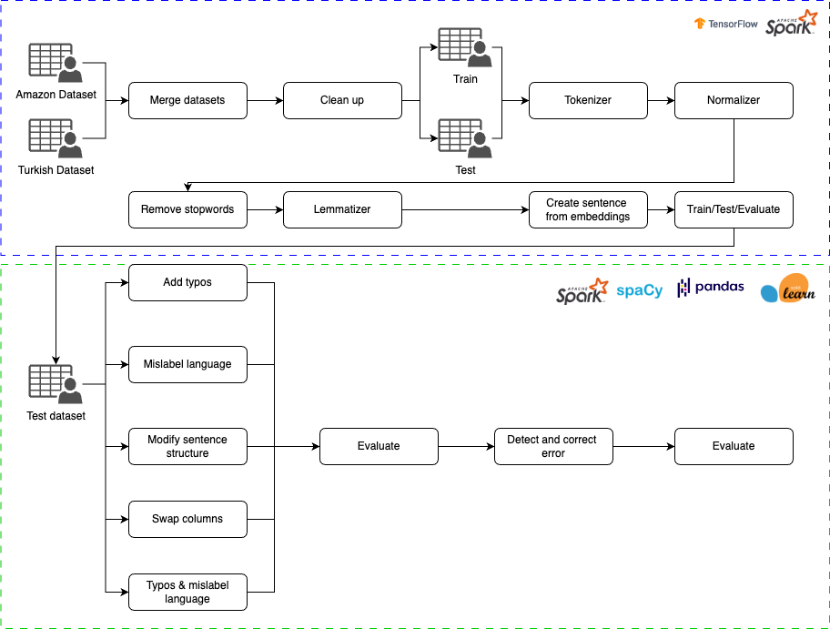

## Introduction

This repository contains the code for the course Data Prepatation Course. The course is part of the Computer Science Master at the University of Amsterdam.

## Installation

To install the package, you can use the following command:

```bash
poetry install
```

Download the data from the following link: [data](https://drive.google.com/file/d/1l0c8SnN8U6mzXUP4Oxey64liucCTqNXE/view?usp=sharing) and unzip it in the data folder.

## Usage

Preprocessing and base model training is explained in `base_model_pipeline_processing_training.ipynb` and the error simulation and correction is explained in `error_simulation_correction_pipeline.ipynb`.

Custom classes are done in the `corrections`, `corruptions` and `util` folders.

## Pipeline

